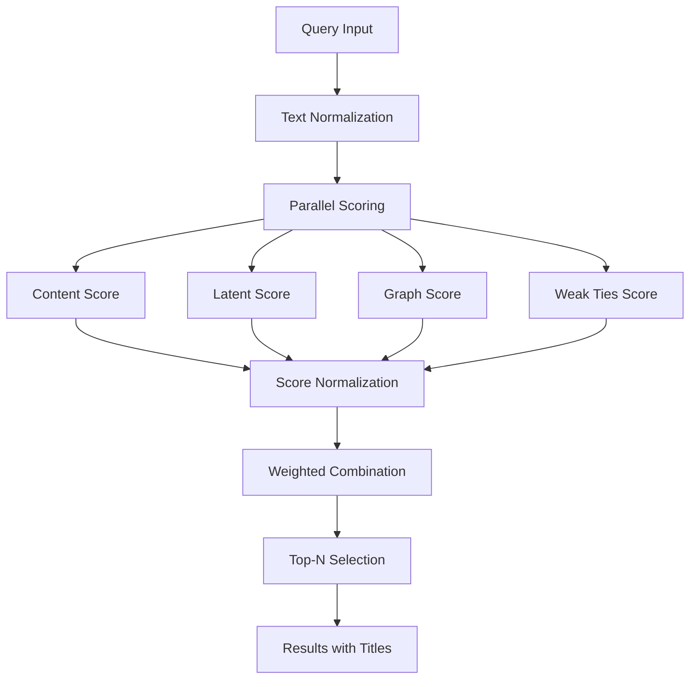

re → Regular expressions (pattern matching in text, e.g. detect "12 kg").
math → Standard math functions (e.g. log).
json → Reading and parsing .json dataset.
numpy (np) → Numerical arrays, vector math.
pandas (pd) → Data handling, table-like structure (DataFrame).
networkx (nx) → Build graphs (nodes and edges) to capture product–attribute relationships.
sklearn.feature_extraction.text.TfidfVectorizer → Convert text into numerical vectors using TF–IDF (term frequency–inverse document frequency).
sklearn.metrics.pairwise.cosine_similarity → Compute similarity between vectors.
sklearn.decomposition.TruncatedSVD → Dimensionality reduction (LSA/latent semantics).


# 🔍 Weak Ties Search Engine

[](https://python.org)
[](LICENSE)
[](https://github.com)

> A hybrid recommendation system that discovers products through multiple intelligence layers: content matching, semantic understanding, graph relationships, and weak ties theory.

## 🎯 Overview

This engine goes beyond simple keyword matching to find relevant products using four complementary approaches:
- **Direct matching** for obvious connections
- **Semantic analysis** for conceptual relationships  
- **Graph networks** for indirect connections
- **Weak ties theory** for unexpected discoveries

## 📚 Dependencies

```python
numpy>=1.19.0
pandas>=1.2.0
scikit-learn>=0.24.0
networkx>=2.5.0
```

### Core Libraries

| Library | Purpose | Usage |
|---------|---------|-------|
| **numpy** | Numerical operations | Array handling, mathematical computations |
| **pandas** | Data manipulation | Product data processing, DataFrame operations |
| **scikit-learn** | Machine learning | TF-IDF vectorization, cosine similarity, SVD |
| **networkx** | Graph analysis | Bipartite product-attribute networks |
| **json** | Data parsing | Product data loading |
| **re** | Text processing | Regular expressions for normalization |

## 🚀 Quick Start

```python
import json
from weak_ties_engine import WeakTiesRecommender

# Load your product data
with open("products.json", "r") as f:
    records = json.load(f)

# Initialize and train the engine
engine = WeakTiesRecommender()
engine.fit(records)

# Get recommendations
results = engine.recommend("wireless headphones", top_n=5)

# Display results
for i, product in enumerate(results, 1):
    print(f"{i}. {product['title']}")
```

## 📋 Data Format

Your product data should be a JSON array of objects with an `id` field:

```json
[
  {
    "id": "123",
    "Model Number": "WH-1000XM4",
    "Type": "Headphones",
    "Brand": "Sony",
    "Features": "Noise Cancelling, Wireless",
    "Price": "$299"
  },
  {
    "id": "456", 
    "Model Number": "AirPods Pro",
    "Type": "Earbuds",
    "Brand": "Apple",
    "Features": "Active Noise Cancellation",
    "Price": "$249"
  }
]
```

## 🔧 Core Functions

### Text Preprocessing

#### `normalize_value(val: str) → str`
```python
# Standardizes product attributes
"12 V" → "12v"
"1.5 KG" → "1500g" 
" Extra  Spaces " → "extra spaces"
```

#### `flatten_prod(rec: dict) → str`  
```python
# Converts product dict to searchable text
{"brand": "Sony", "type": "Headphones"} → "brand: sony | type: headphones"
```

### Main Engine Class

#### `WeakTiesRecommender.fit(records)`
Builds the search infrastructure:

1. **📊 Data Processing**: Creates searchable product DataFrame
2. **🔤 TF-IDF Vectors**: Generates term-frequency matrices  
3. **🧠 SVD Embeddings**: Creates semantic vector space
4. **🕸️ Graph Network**: Builds product-attribute bipartite graph
5. **📈 Frequency Maps**: Calculates attribute rarity scores

#### `WeakTiesRecommender.recommend(query, top_n=5, **weights)`
Returns ranked product recommendations:

| Parameter | Default | Description |
|-----------|---------|-------------|
| `query` | - | Search text |
| `top_n` | 5 | Number of results |
| `w_content` | 0.5 | Direct match weight |
| `w_latent` | 0.2 | Semantic similarity weight |
| `w_graph` | 0.3 | Network relationship weight |

## 🧮 Scoring Algorithms

The engine combines four different scoring methods:

### 🎯 Content Score (`_content_score`)
- **Method**: TF-IDF cosine similarity
- **Purpose**: Direct keyword matching
- **Best for**: Exact term searches like "Sony headphones"

### 🧠 Latent Score (`_latent_score`) 
- **Method**: SVD embedding similarity
- **Purpose**: Semantic understanding
- **Best for**: Conceptual queries like "audio equipment"

### 🕸️ Graph Score (`_graph_score`)
- **Method**: Personalized PageRank
- **Purpose**: Network relationship discovery
- **Best for**: Finding products through shared attributes

### 💎 Weak Ties Boost (`_weak_ties_boost`)
- **Method**: Rare attribute connection weighting
- **Purpose**: Surfacing unexpected but valuable matches
- **Best for**: Discovering niche or complementary products

## 🔄 Algorithm Workflow



## ⚡ Performance & Scaling

## Key Features

### Multi-Modal Scoring
Combines multiple approaches to capture different types of relevance

### Weak Ties Theory
Emphasizes rare attribute connections that can lead to surprising discoveries

### Graph-Based Discovery
Uses product-attribute relationships to find indirect connections

### Configurable Weights
Allows tuning the balance between different scoring methods

## Usage Example

```python
# Load product data
with open("products.json", "r") as f:
    records = json.load(f)

# Initialize and train
engine = WeakTiesRecommender()
engine.fit(records)

# Get recommendations
results = engine.recommend("wireless headphones", top_n=5)
```

## Data Requirements

### Input Format
List of dictionaries with product attributes:
```json
[
  {
    "id": "123",
    "Model Number": "WH-1000XM4",
    "Type": "Headphones",
    "Brand": "Sony"
  }
]
```

### Key Fields
- **id**: Unique product identifier (required)
- **Other attributes**: Any product features (brand, type, specs, etc.)

## Performance Considerations

- **Memory**: Stores full TF-IDF matrix and graph in memory
- **Scalability**: Best for datasets under 10,000 products
- **Speed**: Fast queries after initial fitting phase
- **Accuracy**: Improves with richer product attribute data